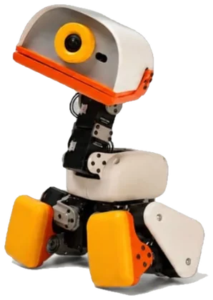

# Duckverse

### Raise a robot duck. Keep it charged. Earn DuckCoin.

*Qwak!*

 

## The game

You adopt a small robot duck, name it, and raise it into something worth showing off.

Feed it, play with it, keep its stats up. Neglect it and it gets weak, and a rare duck can
faint on you. Along the way you open chests, collect rarer models and gear, level up, breed
new ducks, run quests, and take your duck into two minigames.

 

## Your duck

Fourteen models across five rarities. Three are starters; everything rarer drops from a Duck
Chest or comes from breeding.

| Rarity | Models |
| :--- | :--- |
| **Common** | Cream · Graphite · Sky |
| **Rare** | Lavender · Moss · Frost |
| **Epic** | Ember · Tuxedo · Night |
| **Legendary** | Chrome · Volt · Prism |
| **Mythic** | Golden · Eternal |

Every rare or better model carries one permanent perk while it is the duck you are raising.
They run from cheaper shop prices and slower hunger up to the two mythics: **Golden** doubles
all DC income, **Eternal** stops your stats decaying at all.

Ducks you are not currently raising keep their own levels, stats and gear, so switching costs
you nothing. Equipment stays on the duck it belongs to.

 

## Every duck has its own voice

Tap your duck and it answers. Not a stock sound effect: the voice is built from scratch each
time, from a harmonic oscillator with vibrato, jitter, a buzz and a breath of noise, all shaped
by a personality your duck gets from its model.

That means a Cream Duck always sounds like a Cream Duck, a Golden Duck always sounds like a
Golden Duck, and no two models sound alike. Each one has a greeting, a low tock when it eats,
and a delighted glide when it levels up. Nothing is repeated the same way twice.

 

## Things to do

**Care.** Fullness, happiness and health all drift down over time. Food restores them and
grants XP, rarer food grants more, and mythic food restores everything at once.

**Chests.** Food, gear and duck chests, each with a spinning reel and the drop odds shown
before you pay. Rarer chests are the only route to the best models.

**Gear.** Four slots per duck: head, jacket, toy and boots. Each slot has seven items, and the
rarer the item the bigger the permanent bonus. Mythic gear does not just slow decay, it makes
the stat regenerate.

**Breeding.** From level 5, put DC in and get a chance at a duck you do not own yet.

**Rhythm.** A four lane track, 300 notes, chords getting denser as the run goes on, with a
combo multiplier that rewards clean play. Top scores pay out every hour.

**Arena.** Send your duck into a fight against another player's. Battle power comes from
rarity, level and equipped gear. Win and you take XP, DC and sometimes a piece of their gear.

**Quests.** Long running goals such as winning arena fights, reaching a level, or scoring high
in the rhythm game. Each one pays out in real ETH, and each is a race: the first player to
claim it closes it for everyone.

 

## DuckCoin

**DC** is the in game currency. You earn it by playing, by leaving your duck to farm passively,
and by winning; you spend it on everything in the shop. Your balance lives on the server, not
in your browser, so it cannot be edited by tampering with a save file.

**ETH** is the real money layer, on **Robinhood Chain**. It buys DC, settles the marketplace,
and pays out quests.

> **$DC is not launched yet.** The plan is to launch it on Robinhood Chain paired with the NVDA
> RWA token. Until that happens the token panel in game says *not launched*, and any contract
> address claiming to be $DC is not ours.

 

## Marketplace

List a duck for a fixed price in ETH and it goes into escrow, leaving your collection until it
sells or you cancel. Whoever buys it gets the duck with its level, its stats and everything it
was wearing. The treasury takes a small cut, the rest is yours.

 

---

Microduck is a product of [Pollen Robotics](https://pollen-robotics.com/microduck/).
Duckverse is a fan project, not affiliated with or endorsed by Pollen Robotics, Hugging Face or
NVIDIA. See [NOTICE.md](NOTICE.md).

